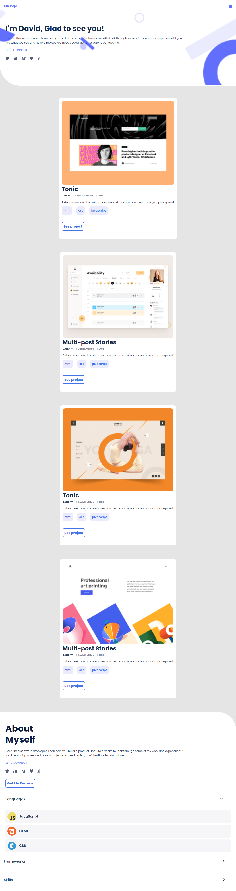

# Mobile Version Portfolio Buit By David Lyangenda

> For the first milestone in the process of creating my portfolio website, i will:
set up a new repository and prepare it for development using best practices (e.g. linters).build the first 2 sections of the mobile website using the template i will choose on figma..

## Built With

- HTML
- CSS

## Instructions on how to access my project locally
To Access my project locally please follow the following instructions;
1. Enter this url:  in your web browser.
2. Once opened navigate to the top left level of the project a green code download button will be visible on the righthand side.
3. Select download Zip option from drop down menu.
4. Once the download is complete you will be able to access my project locally.
Here is my repository link: 

👤 **Author1**

- GitHub: [@githubhandle](https://github.com/LYANGEND)
- Twitter: [@twitterhandle](https://twitter.com/twitterhandle)
- LinkedIn: [LinkedIn](https://www.linkedin.com/in/david-lyangenda-623087151/)

## 🤝 Contributing

Contributions, issues, and feature requests are welcome!
Feel free to check the [issues page](../../issues/).

## Show your support

Give me a ⭐️ if you like this project!

## Acknowledgments

- Hat tip to anyone whose code was used

## 📝 License

This project is [MIT](./MIT.md) licensed.
