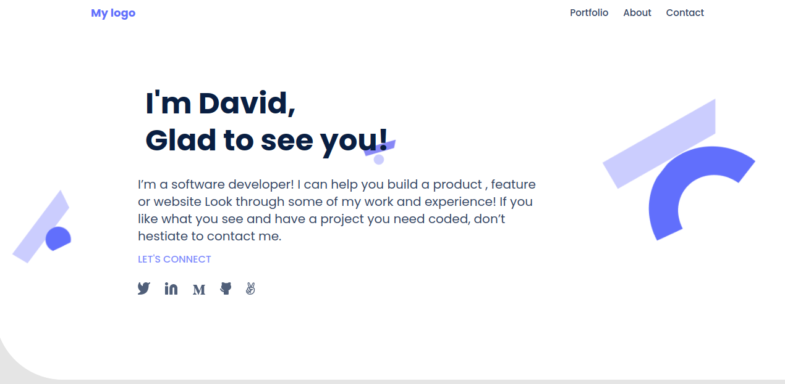

# David Lyangenda's Personal Portfolio

This is my pesonal Website and Portfolio that list all my profissional skils, Resume and the awsome work.

# Screen Shots

## Desktop Version

## Mobile Version

## Built With &hearts;

- HTML
- CSS

## Live Demo

[Ckeckout The live Site here]
https://lyangend.github.io/MyPortfolio/

## Getting started

to run the project locally, clone the project using the command

`git@github.com:LYANGEND/MyPortfolio.git`

### Run test

navigate in to the project directory, from GitHub,
to test or run the application double click on the `index.html` file to open in your browser

## Author

👤 **Author**

- GitHub: [@LYANGENDA](https://github.com/LYANGEND)
- Twitter: [@lyangenda](https://twitter.com/david_lyangenda)
- LinkedIn: [LinkedIn](https://www.linkedin.com/in/david-lyangenda-623087151/)

## 🤝 Contributing

Contributions, issues, and feature requests are welcome!

Feel free to check the [issues page](../../issues/).

## Show your support

Give a ⭐️ if you like this project!

## Acknowledgments

- Hat tip to anyone whose code was used
- Microverse program
- My standup team
- Microverse team
- My family's support

## 📝 License

This project is open source project.
